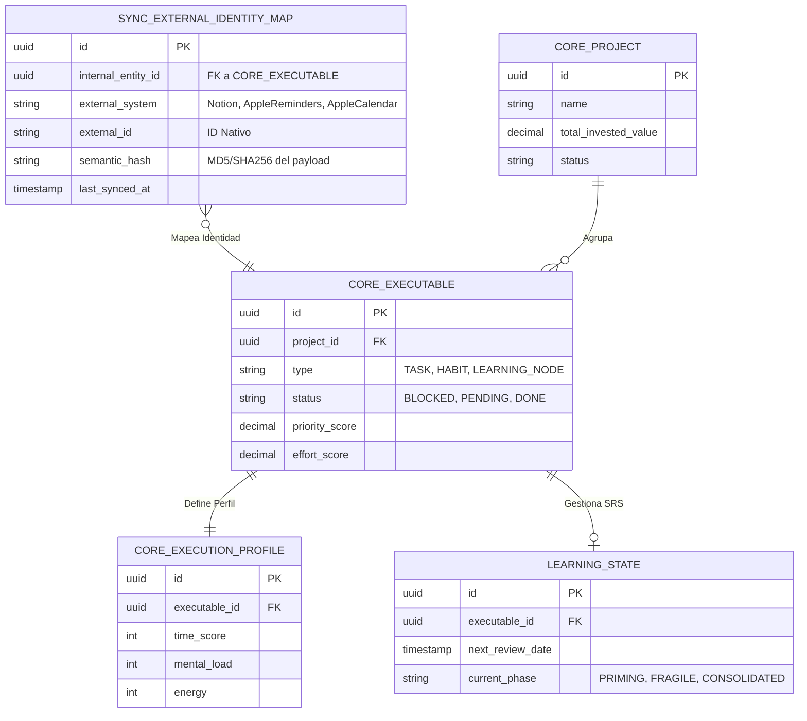

# 🧭 SOPFC: Sistema de Orquestación Productiva, Financiera y Cognitiva

**Arquitectura de Gemelo Digital de Rendimiento (SSOT + EDA)**

## 1. Planteamiento del Proyecto y Propósito

El SOPFC actúa como un **gemelo digital de rendimiento**. Su propósito es orquestar de forma inteligente tareas, rutinas, aprendizaje y finanzas, maximizando la ejecución de Metas Crucialmente Importantes (MCI) y minimizando la fricción cognitiva.

El sistema opera bajo una **Arquitectura Headless (EDA)**. Una base de datos SQL actúa como la Fuente Única de Verdad (SSOT), relegando herramientas externas como Notion (panel de control) e iOS (Calendar/Reminders/Shortcuts) a interfaces de captura y ejecución. Cada proyecto se trata como un *Cost Center* (Centro de Costos), cruzando el esfuerzo (tiempo, carga mental) con la realidad financiera para calcular un Micro-ROI preciso.

## 2. Fundamentos de Productividad Aplicados

El sistema no solo automatiza datos, sino que codifica metodologías probadas en sus algoritmos:

1. **4DX (Las 4 Disciplinas de la Ejecución):** Separación algorítmica entre *Lag Measures* (Ciclos, Objetivos) e *Lead Measures* (Nodos ejecutables diarios priorizados). Mantenimiento de un Scoreboard en Notion.
2. **Hábitos Atómicos:** Inyección automatizada de tareas repetitivas con progresión de dificultad (sobrecarga progresiva) gestionada por el `Habit Generator`.
3. **GTD + Deep Work:** Descarga mental en el *SSOT*. Protección de franjas de atención mediante `Agenda Planner` basado en esfuerzo, energía requerida y carga mental.
4. **Active Recall & Spaced Repetition (SRS):** Integrado en el Motor Cognitivo para asimilar conceptos técnicos, detectando deuda estructural ($N-1$) y modulando el ancho de banda biológico del usuario.

## 3. Topología del Sistema y Módulos

El sistema backend se compone de módulos aislados comunicados mediante eventos internos (Spring ApplicationEvents) en el monolito modular, preparado para escalar a microservicios mediante el patrón **Transactional Outbox**.

### 3.1 Grafo de Readmes (Arquitectura de Módulos)

Haz clic en los enlaces para navegar a la documentación profunda de cada motor:

* **Motores de Ejecución**
    * [[sync/README-sync.md|Sync Engine (ACL & Identity Map)]]: El puente con el mundo exterior (Notion, iOS).
    * [[core/README-core.md|Core API (State & DAG Manager)]]: El orquestador de estado y dependencias.
    * [[prioritizer/README-prioritizer.md|Task Prioritizer]]: El cerebro matemático de priorización reactiva.
    * [[planner/README-planner.md|Agenda Planner]]: El optimizador de bin-packing estocástico para la agenda.

* **Motores Inteligentes**
    * [[cognitive/README-cognitive.md|Cognitive Engine (FSM & LLM Orchestrator)]]: El guardián del ancho de banda mental y aprendizaje acelerado.
    * [[finance/README-finance.md|Financial Service (ZBB & Micro-ROI)]]: Contabilidad de partida doble y atribución de costos.

* **Componentes Transversales**
    * [[common/README-common.md|Common Components]]: Componentes compartidos, eventos y utilidades EDA.
    * [[app/README-app.md|App & Bootstrap]]: Configuración central y arranque del sistema.
    * [[it/README-it.md|Integration Tests]]: Pruebas E2E y validación sistémica.

---

## 4. Modelo de Datos Maestro (ERD)

El esquema separa las responsabilidades lógicas, garantizando integridad referencial mediante *soft-keys* entre esquemas donde sea necesario.

## 5. Estándares de Ingeniería
* **Arquitectura:** Monolito Modular con enfoque **Hexagonal (Ports & Adapters)**.
* **Comunicación:** Event-Driven Architecture (EDA) mediante **Transactional Outbox**.
* **Persistencia:** PostgreSQL. Sistema monousuario de uso personal.
* **Configuración:** Externalización completa (12-Factor App).

---
© 2026 HyperBrain Engineering. Todos los derechos reservados.
