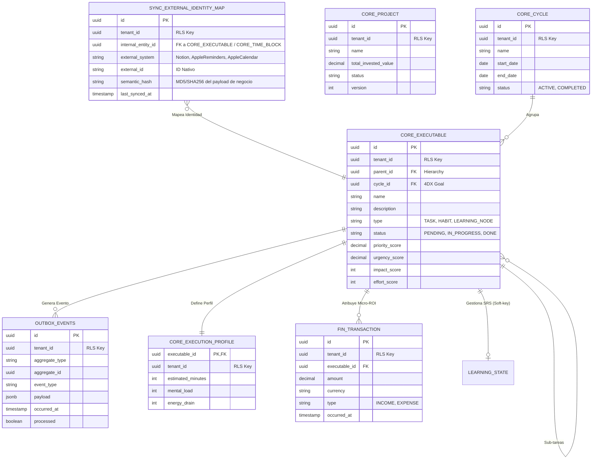

# 🧭 SOPFC: Sistema de Orquestación Productiva, Financiera y Cognitiva

**Arquitectura de Gemelo Digital de Rendimiento (SSOT + EDA)**

## 1. Misión y Propósito
El SOPFC es un ecosistema diseñado para actuar como la **Fuente Única de Verdad (SSOT)** de la vida operativa de un usuario de alto rendimiento. Su objetivo es orquestar inteligentemente tareas, finanzas, aprendizaje y biometría, minimizando la carga cognitiva y maximizando el retorno de inversión sobre el tiempo (Micro-ROI).

## 2. Modelo de Datos Maestro (ERD)
Este diagrama representa la estructura ósea del sistema, dividida por esquemas lógicos y protegida por RLS.

## 3. Mapa del Sistema (Obsidian Hub)
Haz clic en los enlaces para navegar a la documentación profunda de cada motor:

### 🛠️ Motores de Ejecución
* [[src/main/java/com/hyperbrain/sopfc/sync/README-sync|Sync Engine (ACL & Identity Map)]]: El puente con el mundo exterior (Notion, iOS).
* [[src/main/java/com/hyperbrain/sopfc/core/README-core|Core API (State & DAG Manager)]]: El orquestador de estado y dependencias.
* [[src/main/java/com/hyperbrain/sopfc/prioritizer/README-prioritizer|Task Prioritizer]]: El cerebro matemático de priorización reactiva.
* [[src/main/java/com/hyperbrain/sopfc/planner/README-planner|Agenda Planner]]: El optimizador de bin-packing estocástico para la agenda.

### 🧠 Motores Inteligentes
* [[src/main/java/com/hyperbrain/sopfc/cognitive/README-cognitive|Cognitive Engine (SRS & FSM)]]: El guardián del ancho de banda mental y aprendizaje acelerado.
* [[src/main/java/com/hyperbrain/sopfc/finance/README-finance|Financial Service (ZBB & Micro-ROI)]]: Contabilidad de partida doble y atribución de costos.

---

## 4. Fundamentos Teóricos del Ecosistema
El sistema no es solo software; es la codificación de metodologías de rendimiento:

1. **4DX (Las 4 Disciplinas de la Ejecución):** Separación de *Lag Measures* (Ciclos) vs *Lead Measures* (Lead Nodes diarios).
2. **Hábitos Atómicos:** Inyección de rutinas con progresión de dificultad gestionada algorítmicamente.
3. **Zettelkasten + SRS:** Gestión de conocimiento mediante Active Recall y Repetición Espaciada integrada en el flujo de trabajo.
4. **Zero-Based Budgeting (ZBB):** Cada dólar (y cada minuto) debe tener un propósito asignado antes de ser gastado.

## 5. Estándares de Ingeniería
* **Arquitectura:** Monolito Modular con enfoque **Hexagonal (Ports & Adapters)**.
* **Comunicación:** Event-Driven Architecture (EDA) mediante el patrón **Transactional Outbox**.
* **Persistencia:** PostgreSQL con **Row-Level Security (RLS)** obligatorio para aislamiento de datos.
* **Integridad:** Uso de **Hashes Semánticos** para evitar ruido en la sincronización.

---
© 2026 HyperBrain Engineering. Todos los derechos reservados.
